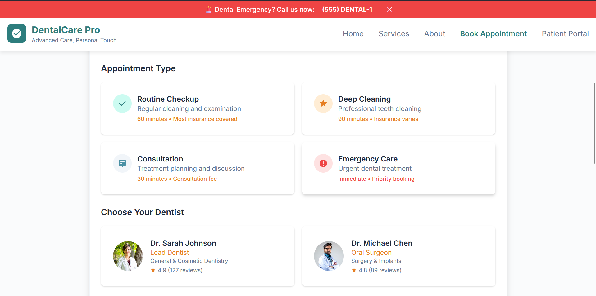
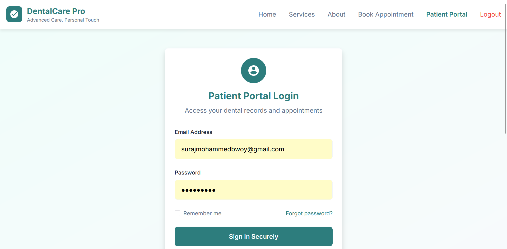

# DentalCare Pro - Healthcare Management System

A comprehensive dental practice management system built with modern web technologies and Supabase backend.


## Features

### Patient Portal
- Secure patient login/registration
- View upcoming and past appointments
- Access medical records and treatment history
- Insurance information management
- Secure messaging with dental team
- Online bill payment
- Treatment plan progress tracking



### Staff Dashboard
- Staff authentication and role management
- Real-time dashboard with key metrics
- Patient search and management
- Appointment scheduling and management
- Treatment planning and tracking
- Reporting and analytics
- Inventory management
- Communication tools



### Public Website
- Modern, responsive design
- Service information and team profiles
- Online appointment booking
- Patient testimonials and reviews
- Contact information and location
- Emergency contact options


## Technology Stack

### Frontend
- HTML5, CSS3, JavaScript (ES6+)
- Tailwind CSS for styling
- Responsive design with mobile-first approach
- Modern UI components and animations

### Backend
- Supabase (PostgreSQL database)
- Real-time subscriptions
- Row Level Security (RLS)
- Authentication and authorization
- File storage for medical records

### Security
- HIPAA-compliant data handling
- Encrypted data storage
- Secure authentication flows
- Role-based access control
- Audit logging

## Setup Instructions

### 1. Supabase Setup
1. Create a new Supabase project at [supabase.com](https://supabase.com).
2. Copy your project URL and anon key.
3. Update the credentials in `js/supabase-config.js`:
   ```javascript
   const supabaseUrl = 'YOUR_PROJECT_URL';
   const supabaseAnonKey = 'YOUR_ANON_KEY';
